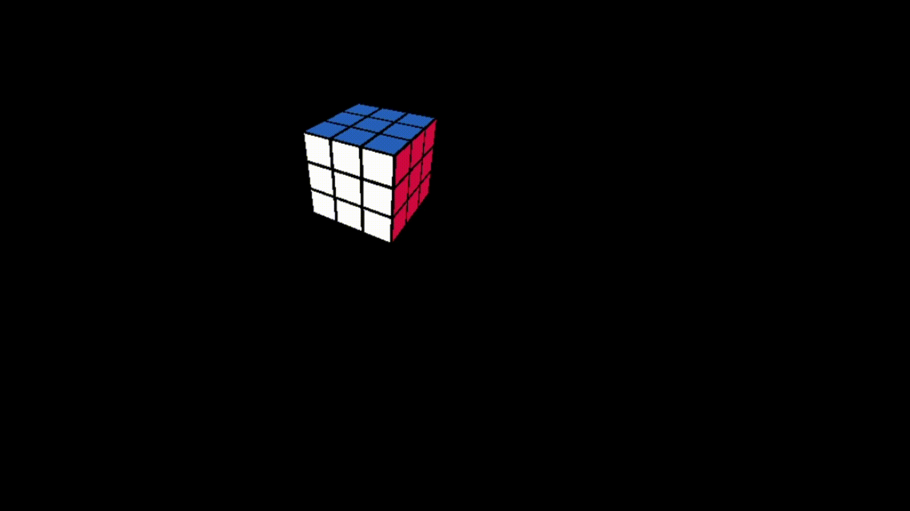

# 3D Rubik's Cube

## 概要

C言語で制作した、キーボード操作により回転できる3Dルービックキューブです。  
OpenGL / GLU / freeglut を用いて3D空間上にルービックキューブを描画し、各面の回転や視点変更を行えるようにしました。

本リポジトリではポートフォリオ用として、自作したソースコード、テクスチャ画像、動作画面を公開しています。

## デモ

<!-- 動作GIFまたはスクリーンショットを追加したら、以下のコメントアウトを外してください -->

<!--

-->

<!--

-->

## 制作背景

C言語によるグラフィックス処理、3D座標の扱い、キーボード入力による状態更新を学ぶために制作しました。  
単に3Dモデルを表示するだけでなく、実際に操作できるルービックキューブとして動作することを目標にしました。

## 主な機能

- 3Dルービックキューブの描画
- キーボード操作による各面の回転
- マウスによる視点の移動・回転
- 各パーツの色・位置情報の管理
- 回転後の状態更新
- 自作テクスチャ画像の使用

## 使用技術

- C言語
- OpenGL
- GLU
- freeglut
- Bitmap画像テクスチャ

## 工夫した点

### 1. 操作可能な3Dルービックキューブとして実装

表示するだけでなく、キーボード入力によって各面を回転できるようにしました。  
入力に応じて描画内容を更新し、ユーザーが実際に操作できる形にした点を工夫しました。

### 2. 回転後の状態管理

ルービックキューブは、面を回転するたびに各パーツの位置や色の対応関係が変化します。  
そのため、回転操作後も表示が崩れないように、各パーツの状態を管理しながら更新する処理を実装しました。

### 3. 3D空間での見やすさ

キューブの状態を把握しやすいように、視点変更の機能を実装しました。  
これにより、複数方向からキューブを確認しながら操作できるようにしました。

### 4. 自作テクスチャの使用

ルービックキューブの見た目を表現するために、自作したテクスチャ画像を使用しました。  
3D描画だけでなく、画像を用いた表現にも取り組みました。

## 動作確認環境

制作時は以下の環境で動作確認しました。

- OS: Windows
- 開発環境: Visual Studio
- 言語: C言語
- ライブラリ:
  - OpenGL
  - GLU
  - freeglut

## 実行について

本プログラムは、制作当時の授業環境で動作確認しています。  
画像読み込み処理には、授業で配布された `read_bitmap.h` を使用していました。

`read_bitmap.h` は授業配布物であり、再配布の許可が明確ではないため、本リポジトリには含めていません。  
そのため、このリポジトリ単体ではそのままビルドできない可能性があります。

本リポジトリでは、主に以下を公開しています。

- 自作したソースコード
- 自作したテクスチャ画像
- 動作画面
- 実装内容の説明

## 操作方法

<!-- 実際のキー操作に合わせて修正してください -->

| キー | 動作 |
|---|---|
| U | 上面を回転 |
| D | 下面を回転 |
| R | 右面を回転 |
| L | 左面を回転 |
| F | 前面を回転 |
| B | 背面を回転 |
| Space | 初期状態に戻す |
| マウスホイール長押し | 視点変更 |

## ディレクトリ構成

```text
rubiks_cube/
├── README.md
├── src/
│   └── main.c
├── assets/
│   └── texture.bmp
└── docs/
    └── demo.gif
